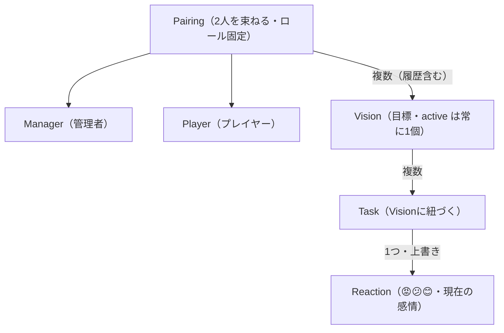
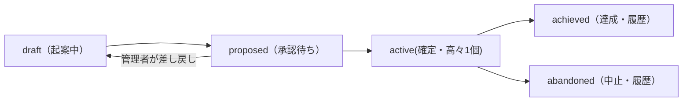
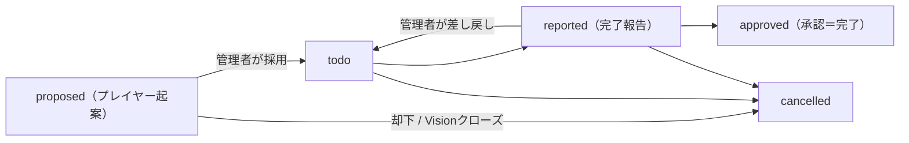

# PairCommit 設計メモ

> アプリ名 `PairCommit` は開発用の仮名。表示名（`CFBundleDisplayName`）は後で差し替え可能なので、リポジトリ・Bundle ID・モジュール名とは切り離して扱う。
> - リポジトリ / モジュール: `PairCommit`
> - Bundle ID: `com.daiki.paircommit`

2人で使うコミットメントデバイス。自己管理が難しいのは「誰も見ていない」から、という前提に立ち、パートナーを観測者として置く。アカウンタビリティパートナーの仕組みをアプリ化する。

---

## コンセプト

- 本質は **他人を巻き込んだコミットメントデバイス**。ユリシーズが自分を帆柱に縛らせた構造。
- 普通のTodoアプリ（全ユーザー対等・フラット）と決定的に違うのは **ロールの非対称性**。設計の中心は機能ではなくロール。
- 「目的地は自分で選び、執行権限を相手に明け渡す」。支配ではなくコミットメントデバイスに留めるための境界が全体を貫く。

---

## ロール（決定）

- **Manager（管理者）** / **Player（プレイヤー）** の2値。
- スワップなし。入れ替えたい場合はアプリのリセットで再ペアリング。
- 非対称の中身:
  - 管理者: タスクの生成・完了承認・催促・ビジョン承認・ビジョン達成判断。
  - プレイヤー: ビジョンの起案、進捗報告、感情表現。**唯一の主体性が「感情を表明すること」**。
- 管理者が絶対なのは **手段（タスク・催促・承認）に対してであり、目的（ビジョン）に対してではない**。この境界が支配との分かれ目。

---

## ペアリング（決定）

- **MultipeerConnectivity** を使う。Bluetooth/WiFiで近くの端末を発見して握手。
- **MCはペアリングの瞬間にしか使わない。** 一回限りのイベント。リセットまで再利用しない。
- 制約: MCは同じ場所にいる前提。離れた2台の日常的な同期には使えない。同期は別層（CloudKit）が担う。
- MCの役割は「2人が同じペアであることを示す情報の交換」だけ。日常の通信路はサーバー（CloudKit）。
- 演出: NameDropの「ブワっ」はシステム専用でアプリから発火不可（NFCのP2Pモードがそもそもアプリに開放されていない）。ペアリング成功時のアニメは **自前で作る**。

## 同期層（決定: CloudKit）

- **CloudKit の Shared DB / CKShare** を使う。2人で特定レコードを共有する用途に設計されている。
- **CKSyncEngine**（WWDC 2024）で同期処理を簡略化。変更トークン管理・プッシュ受信処理・ゾーン設定が大幅に楽に。
- 催促のプッシュ通知は CloudKit subscription で飛ばす。
- 採用理由: 本丸である「同期・認証・プッシュ」を3つともタダで肩代わり。2人なら無料枠に完全に収まる。
- **ロックイン: 両者ともApple端末必須。** ただし下記の隔離設計で、後からの置き換えを可能にしておく。
- 既知の制約:
  - 観測性が低い（サーバーが手元にない＝同期失敗のデバッグがブラックボックス気味）。
  - 共有レコードのzoneIDがオーナーと参加者で一致しない。参加者側がレコードを追加する設計では一手間。
  - Apple純正の上に乗るのでRustの素振りにはならない。

### 隔離設計（決定: 置き換え可能にする）

- Androidは今は対応しないが、**なくてもいい代わりに、後で置き換えられる構造にしておく。**
- ドメイン層は `SyncRepository` のようなプロトコルとだけ会話する。CloudKitはその実装の一つ。**ドメインはCloudKitの存在を知らない。**
- 同期層のセマンティクス（ドメインは何が保証されれば動くか）を先に決め、CloudKit依存をこのプロトコルの裏1点に隔離する。
- これにより第二期のRust/自作バックエンドは「もう一つの実装」を差すだけで済む。
- 実装上はローカルSPMパッケージ `Packages/PairCommitCore` の `Domain` / `Application` モジュールに分離済み（import できない＝依存方向をコンパイラが強制）。Presentation モジュールはロール別UI実装時に切り出す。

### 第二期構想（後回し）

2人版が関係性ツールとして機能すると検証できたら、自作Rustバックエンドに載せ替えてRust化＆Android対応。**コンセプト検証とインフラ学習は同時にやらない。**

---

## ビジョン（決定）

- **アクティブなビジョンは高々1個** という不変条件が中心。タスクの無限増殖を防ぎ、焦点を1つに絞ること自体が規律になる。
  - 厳密には「同時に2個以上は存在しない」。0個は初期状態とクローズ直後にだけ現れる過渡状態で、UIは次のビジョン設定へ誘導する。
- 発生源はプレイヤー、執行権限は管理者。
- ライフサイクル: `draft`（起案中）→ `proposed`（承認待ち）→ `active`（確定・高々1個）→ `achieved` / `abandoned`（履歴）
  - 管理者は `proposed` を承認せず **draft に差し戻せる**（却下は削除ではなく差し戻し。起案の主導権はプレイヤーに残る）。
- タスクの `todo → reported → approved` と対称。どちらも「起案→承認」の型。
- **達成判断は管理者の質的判断**。タスクの自動ロールアップではない（タスク=具体、ビジョン=抽象なので機械的には決まらない）。
- 達成の基準だけはペアリング/設定時に2人で言語化しておく（管理者の判断が気分で揺れないように）。**執行は独裁、憲法は共同制定。**
- ビジョンを閉じるとき、配下の未承認タスクも一緒に閉じる（残骸を引きずらない）。
- 達成したビジョンの履歴 + 感情リアクションの履歴 = **2人で歩んできた記録**として積み上がる。

### ビジョンのフォーマット

| 項目 | 必須/任意 | 役割 |
|---|---|---|
| statement（一文） | 必須 | ビジョンそのもの。例「半年で10kg痩せて健康診断オールA」 |
| doneCriteria（達成基準） | 必須 | 管理者の達成判断のよりどころ。憲法の改正条件にあたる |
| deadline（期限） | 推奨 | 催促のペース配分に直結。残り日数で催促の強弱を決める |
| why（動機） | 推奨 | 管理者が催促トーンを測る材料 + プレイヤーがしんどい時に立ち返る錨 |

---

## タスク（決定）

- 管理者が所有・生成する。
- ライフサイクル: `proposed`（プレイヤー起案・採用待ち）→ `todo` → `reported`（プレイヤーが完了報告）→ `approved`（管理者が承認＝完了）。終端に `cancelled`（却下 / Visionクローズ時の巻き込み）。
  - 管理者が生成したタスクは `todo` から始まる。プレイヤー起案は `proposed` から始まり、管理者の採用（→ `todo`）/ 却下（→ `cancelled`）を待つ。
  - 管理者は `reported` を承認せず **todo に差し戻せる**（やり直しの指示）。
  - `approved` は取り消せない終端。未完了（`proposed` / `todo` / `reported`）は管理者がいつでも `cancelled` にできる。
- プレイヤーが done にしても **承認待ちで止まる**。完了承認は管理者が握る。
- 必ずビジョンに紐づく（全タスクが唯一のビジョンに奉仕する）。タスクは **active なビジョンの下にしか作れない**。
- 承認待ちが溜まったとき管理者にも催促飛ばす
- 起案はプレイヤーもできる（所有・承認は管理者のまま）。プレイヤーにできるのは起案まで。

## 感情リアクション（決定）

- **チャットにしない。** チャットは返信義務を生んで関係を重くする。
- 感情は `Message` ではなく `Reaction`。**対象（Task）に従属する属性**。ストリームではなくステート（その対象に今どう感じているか）。
- 対象は **Task のみ**（Vision への感情表明は持たない）。
- ポジティブもネガティブも両方表現できる。ネガを安全に出せないと「健全に見せる」圧力でしんどさが隠れ、管理者が催促を手加減できなくなる。
- 管理者から見ると、タスク一覧が **感情のヒートマップ** に見える。文字を読まずに関係の温度がわかる。
- 管理者が手段を全部握る設計と噛み合う ── プレイヤーの感情チャンネルが唯一の交渉手段になり、重みが出る。

> 決定：😡 😕 😊
---

## データモデル骨格

- **Pairing** ── 2人を束ねる。ロール固定。`ownerRole`（共有オーナー側が取ったロール）を持ち、各端末の自ロールはこれと「自分がオーナーか」から定まる。
- **Vision** ── プレイヤーの目標。タスクの上位。active は高々1個。status を持つ。
- **Task** ── 管理者所有。Visionに紐づく。status を持つ。**コード上の型名は Swift Concurrency の `Task` と衝突するため `TaskItem`**（設計上の呼称は「タスク」のまま）。
- **Reaction** ── 対象（Task）に貼る感情。ポジ/ネガ。実装上は Task の属性（上書き更新のステート）。

### リレーション図

**カーディナリティと不変条件**
- `Pairing` は必ず `manager` 1 + `player` 1 の **2人ちょうど**。ロール固定・スワップなし。
- `Vision` は `Pairing` に N 個ぶら下がる（履歴含む）が、**`status == active` は高々1個**（中心の不変条件。0個は初期状態・クローズ直後のみ）。
- `Task` は必ず1つの `Vision` に紐づく（孤立タスクは存在しない）。所有は manager、`createdBy` で player 起案かを区別。
- `Reaction` は `Task` に従属する **ステート**（ストリームではない）。1タスクにつき player の現在の感情1つ（上書き更新）。Vision には感情を持たない。
- 不変条件・ロール権限・状態遷移の番人は集約ルート `PartnershipState`（ドメイン層）。UI や同期層は個別レコードを直接いじらない。

### 状態の流れ（ステータスがどう移り変わるか）

Vision（閉じる時、配下の未承認タスクも一緒に閉じる）

Task（未完了状態からは管理者がいつでも `cancelled` にできる）

管理者が生成したタスクは `todo` から始まる（`proposed` を経ない）。

## 未決事項まとめ

1. MCで何を渡すか（CKShare URL or 独自トークン）と、CloudKit Sharingの招待フローとの噛み合わせ
   -> **方針決定: MCで `CKShare.url` を手渡し、参加者は共有シートを経由せず `CKFetchShareMetadataOperation` + `CKAcceptSharesOperation` でプログラム受諾**（独自トークンは不要）。
   -> **成功判定はACKで締める**: 参加者が受諾を終えたらMCで ACK を返し、オーナーはそれを受けて初めて成功にする（URL送信だけで成功表示すると相手の受諾失敗を見逃す）。
   -> スパイク実装済み（`PairCommit/Partnership/`、ブランチ `spike/mc-cloudkit-pairing`）。
   -> **実行検証は保留**: CloudKit は有料の Apple Developer Program 必須（無料署名では capability が降りない）。加入後にスパイクで実機検証する。設計が `SyncRepository` で隔離しているため本体着手のネックにはならない。
2. データモデルのリレーション図作る -> 済（「データモデル骨格 > リレーション図 / 状態の流れ」参照）
3. ビジョン達成時のお祝い演出 → 次ビジョン設定への画面遷移 -> できればやるくらいで
4. ビジョンのクライテリアをFoundationModelに基準をレビューさせてもよい -> できればやるくらいで
5. **ペアリング時のロール割り当て**: どちらが Manager かをMCハンドシェイクでどう確定するか（案: オーナーが自ロールを選び、URLと一緒に送って `Pairing.ownerRole` に固定する）。
6. **片側リセット時の整合性**: 片方だけがアプリをリセットしたとき、CKShare の参加解除・ゾーン削除・相手側への通知をどう扱うか。
7. **催促の具体仕様**（ロードマップ7): 期限からの逆算ペース、承認待ち滞留の閾値、通知チャネル（CloudKit subscription）の設計。

## 現状（2026-07-04 時点）

**PRスタック**（下から順にマージする。各PRのベースは1つ下のブランチ）:

| PR | ブランチ | 内容 |
|---|---|---|
| #1 (draft) | `spike/mc-cloudkit-pairing` | MC+CloudKit ペアリングスパイク＋修正（ACK・displayName衝突・Swift 6対応）。実機検証は Developer Program 加入待ち |
| #2 | `feature/domain-layer` | ドメインモデル・集約 `PartnershipState`・`SyncRepository`・`InMemorySyncRepository`・`PartnershipStore`・ユニットテスト |
| #3 | `feature/test-infrastructure` | VRT（Prefire）・CI（GitHub Actions）・`Scripts/test.sh`。CI失敗はアーキ差のAA許容値で修正済み |
| #4 | `feature/coding-standards` | マルチモジュール化（`Packages/PairCommitCore`: Domain / Application）・SwiftLint・Khorikov流テスト書き直し・CLAUDE.md原則 |

**できていること**: ドメイン層（不変条件・ロールガード・全遷移＋テスト27件）/ 同期境界とインメモリ実装 / VRT・CI・SwiftLint の自動化基盤 / 設計・テスト原則の明文化（CLAUDE.md）。

**保留**: CloudKit 実行検証（Developer Program 加入待ち）。加入したら PR #1 のスパイクを実機2台で検証する。

## 次のタスク（実装ロードマップ）

方針: **本体は CloudKit を待たずインメモリ実装で進める**。設計の隔離（`SyncRepository`）がここで効く。

1. **ドメインモデル定義** -> 済（`Packages/PairCommitCore/Sources/Domain/`）。
2. **`SyncRepository` プロトコル定義** -> 済（同上。セマンティクスはdoc comment参照）。
3. **`InMemorySyncRepository` 実装** -> 済（`Sources/Application/`。UI結節点の `PartnershipStore` も同じ場所）。
4. **ドメインロジック＋不変条件＋ユニットテスト** -> 済（集約ルート `PartnershipState`。テストは `PairCommitTests/`）。
5. **ロール別UI** ← **次はここ**。あわせて `Presentation` モジュールを `PairCommitCore` に切り出す（`.prefire.yml` のスキャン対象もそのとき移す）。
   - Manager: タスク生成・承認・催促・ビジョン承認・達成判断、タスク一覧＝感情ヒートマップ。
   - Player: ビジョン起案・進捗報告・感情表明（😡😕😊）・タスク起案。
   - ロール選択は当面デバッグ用の切り替えでよい（本来はペアリングで固定 → 未決事項5）。
6. **ライフサイクルUI** ── Vision（draft→proposed→active→achieved/abandoned）/ Task（proposed→todo→reported→approved / cancelled）の遷移。
7. **催促ロジック（双方向）** ── 期限ベースの催促＋承認待ち滞留時に管理者へも催促（具体仕様は未決事項7）。
8. **（加入後）`CloudKitSyncRepository` 差し替え＋#1実行検証**。
9. **（できれば）** 達成お祝い演出→次ビジョン設定 / Foundation Models でクライテリアをレビュー。

---

（アプリの表示名は別途。開発はコード上 `PairCommit` で進め、表示名は最後に差し替える。）
