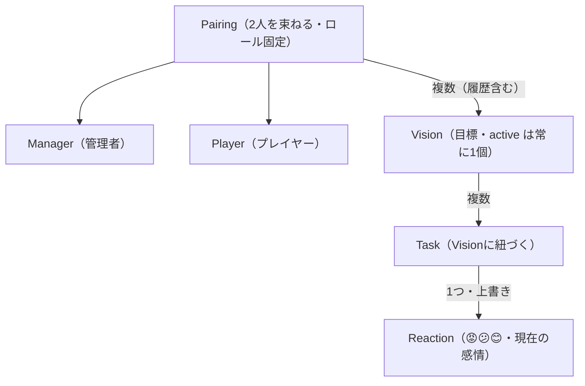
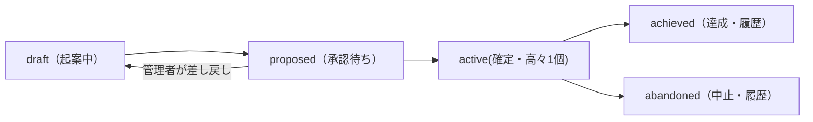
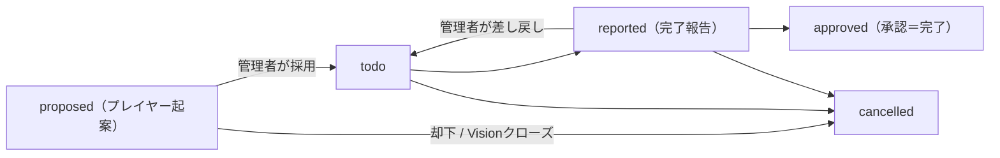

# PairCommit 設計メモ

> 表示名（`CFBundleDisplayName`）は **「ふたりの帆柱」**。ユリシーズが自分を帆柱に縛らせ、部下に「頼んでも解くな」と命じた構造がこのアプリそのもので、縛られる側だけでは装置にならない。ふたり、を頭に置くのはそのため。
> `PairCommit` は開発用の仮名として、リポジトリ・Bundle ID・モジュール名に残す。表示名とは切り離して扱う。
> 英語圏の表示名は未決。`Mastbound` を候補にしているが、これは縛られた側だけを指していて、日本語名で「ふたり」を頭に置いた理由（縛られる側だけでは装置にならない）がそのままでは成り立たない。ローカライズを入れるときに決める。
> - リポジトリ / モジュール: `PairCommit`
> - Bundle ID: `com.fujimori.PairCommit` / CloudKit コンテナ: `iCloud.com.fujimori.PairCommit`

2人で使うコミットメントデバイス。自己管理が難しいのは「誰も見ていない」から、という前提に立ち、パートナーを観測者として置く。アカウンタビリティパートナーの仕組みをアプリ化する。

---

## コンセプト

- 本質は **他人を巻き込んだコミットメントデバイス**。ユリシーズが自分を帆柱に縛らせた構造。
- 普通のTodoアプリ（全ユーザー対等・フラット）と決定的に違うのは **ロールの非対称性**。設計の中心は機能ではなくロール。
- 「目的地は自分で選び、執行権限を相手に明け渡す」。支配ではなくコミットメントデバイスに留めるための境界が全体を貫く。

---

## ロール（決定）

- **Manager（管理者）** / **Player（プレイヤー）** の2値。
- スワップなし。入れ替えたい場合はアプリのリセットで再ペアリング。
- 非対称の中身:
  - 管理者: タスクの生成・完了承認・催促・ビジョン承認・ビジョン達成判断。
  - プレイヤー: ビジョンの起案、進捗報告、感情表現。**唯一の主体性が「感情を表明すること」**。
- 管理者が絶対なのは **手段（タスク・催促・承認）に対してであり、目的（ビジョン）に対してではない**。この境界が支配との分かれ目。

---

## ペアリング（決定）

- **MultipeerConnectivity** を使う。Bluetooth/WiFiで近くの端末を発見して握手。
- **MCはペアリングの瞬間にしか使わない。** 一回限りのイベント。リセットまで再利用しない。
- 制約: MCは同じ場所にいる前提。離れた2台の日常的な同期には使えない。同期は別層（CloudKit）が担う。
- MCの役割は「2人が同じペアであることを示す情報の交換」だけ。日常の通信路はサーバー（CloudKit）。
- 共有は URL を知っている人が参加して書ける設定にする。参加者を名指しで招待する仕組みを持たず、URL を渡すのは MC で近くにいることを確かめた相手だけなので、招待に頼る設定では誰も参加できない。
- 演出: NameDropの「ブワっ」はシステム専用でアプリから発火不可（NFCのP2Pモードがそもそもアプリに開放されていない）。ペアリング成功時のアニメは **自前で作る**。

## 同期層（決定: CloudKit）

- **CloudKit の Shared DB / CKShare** を使う。2人で特定レコードを共有する用途に設計されている。
- **CKSyncEngine は使わない**（当初は採用する決定だったが取り消した）。値を返す `CKDatabase` の async メソッドだけで書く。
  - 集約を1レコードに丸ごと入れるので、CKSyncEngine が肩代わりする変更トークン管理も保留キューも使い道がない。
  - 一方で CKSyncEngine は結果をデリゲートのコールバックで配るため、受け取る側に可変状態を強いる。同期層の実装を `let` だけの struct に保てなくなる。
- 保存は last-writer-wins。`savePolicy: .allKeys` は変更タグを見ずに上書きするので、後から書いた側が勝つ。
  - 2人・単一集約なので、レコード単位のマージは要らない。
- 催促は端末が判定してローカル通知で出す。CloudKit subscription が飛ばすのは、そのきっかけになるサイレントプッシュだけ。
- **相手の変更は、プッシュで起こされた側が取り直す。** 同期層から変更を配るストリームは持たない。配る形にすると、プッシュを受けたアプリ側は取り直しが終わったかを知れず、バックグラウンドの実行時間を返す判断ができない。
- 採用理由: 本丸である「同期・認証・プッシュ」を3つともタダで肩代わり。2人なら無料枠に完全に収まる。
- **ロックイン: 両者ともApple端末必須。** ただし下記の隔離設計で、後からの置き換えを可能にしておく。
- 既知の制約:
  - 観測性が低い（サーバーが手元にない＝同期失敗のデバッグがブラックボックス気味）。
  - 共有レコードのzoneIDがオーナーと参加者で一致しない。参加者側がレコードを追加する設計では一手間。
  - Apple純正の上に乗るのでRustの素振りにはならない。

### 隔離設計（決定: 置き換え可能にする）

- Androidは今は対応しないが、**なくてもいい代わりに、後で置き換えられる構造にしておく。**
- ドメイン層は `PartnershipSyncing` のようなプロトコルとだけ会話する。CloudKitはその実装の一つ。**ドメインはCloudKitの存在を知らない。**
- 同期層のセマンティクス（ドメインは何が保証されれば動くか）を先に決め、CloudKit依存をこのプロトコルの裏1点に隔離する。
- これにより第二期のRust/自作バックエンドは「もう一つの実装」を差すだけで済む。
- 実装上はローカルSPMパッケージ `LocalPackage` の `Domain` / `Application` / `Infrastructure` モジュールに分離済み（import できない＝依存方向をコンパイラが強制）。View はアプリターゲットに置く。
- CloudKit を使う実装だけはアプリターゲット側に置く。パッケージに入れると ubuntu で回している `swift test` が壊れる（達成基準の下読みと同じ理由）。`InMemorySynchronizer` は `Infrastructure` に残す。

### 第二期構想（後回し）

2人版が関係性ツールとして機能すると検証できたら、自作Rustバックエンドに載せ替えてRust化＆Android対応。**コンセプト検証とインフラ学習は同時にやらない。**

---

## ビジョン（決定）

- **アクティブなビジョンは高々1個** という不変条件が中心。タスクの無限増殖を防ぎ、焦点を1つに絞ること自体が規律になる。
  - 厳密には「同時に2個以上は存在しない」。0個は初期状態とクローズ直後にだけ現れる過渡状態で、UIは次のビジョン設定へ誘導する。
- 発生源はプレイヤー、執行権限は管理者。
- ライフサイクル: `draft`（起案中）→ `proposed`（承認待ち）→ `active`（確定・高々1個）→ `achieved` / `abandoned`（履歴）
  - 管理者は `proposed` を承認せず **draft に差し戻せる**（却下は削除ではなく差し戻し。起案の主導権はプレイヤーに残る）。
- タスクの `todo → reported → approved` と対称。どちらも「起案→承認」の型。
- **達成判断は管理者の質的判断**。タスクの自動ロールアップではない（タスク=具体、ビジョン=抽象なので機械的には決まらない）。
- 達成の基準だけはペアリング/設定時に2人で言語化しておく（管理者の判断が気分で揺れないように）。**執行は独裁、憲法は共同制定。**
- ビジョンを閉じるとき、配下の未承認タスクも一緒に閉じる（残骸を引きずらない）。
- 達成したビジョンの履歴 + 感情リアクションの履歴 = **2人で歩んできた記録**として積み上がる。

### ビジョンのフォーマット

| 項目 | 必須/任意 | 役割 |
|---|---|---|
| statement（一文） | 必須 | ビジョンそのもの。例「半年で10kg痩せて健康診断オールA」 |
| doneCriteria（達成基準） | 必須 | 管理者の達成判断のよりどころ。憲法の改正条件にあたる |
| deadline（期限） | 推奨 | 催促のペース配分に直結。残り日数で催促の強弱を決める |
| why（動機） | 推奨 | 管理者が催促トーンを測る材料 + プレイヤーがしんどい時に立ち返る錨 |

---

## タスク（決定）

- 管理者が所有・生成する。
- ライフサイクル: `proposed`（プレイヤー起案・採用待ち）→ `todo` → `reported`（プレイヤーが完了報告）→ `approved`（管理者が承認＝完了）。終端に `cancelled`（却下 / Visionクローズ時の巻き込み）。
  - 管理者が生成したタスクは `todo` から始まる。プレイヤー起案は `proposed` から始まり、管理者の採用（→ `todo`）/ 却下（→ `cancelled`）を待つ。
  - 管理者は `reported` を承認せず **todo に差し戻せる**（やり直しの指示）。
  - `approved` は取り消せない終端。未完了（`proposed` / `todo` / `reported`）は管理者がいつでも `cancelled` にできる。
- プレイヤーが done にしても **承認待ちで止まる**。完了承認は管理者が握る。
- 必ずビジョンに紐づく（全タスクが唯一のビジョンに奉仕する）。タスクは **active なビジョンの下にしか作れない**。
- 承認待ちが溜まったとき管理者にも催促飛ばす
- 起案はプレイヤーもできる（所有・承認は管理者のまま）。プレイヤーにできるのは起案まで。

## 感情リアクション（決定）

- **チャットにしない。** チャットは返信義務を生んで関係を重くする。
- 感情は `Message` ではなく `Reaction`。**対象（Task）に従属する属性**。ストリームではなくステート（その対象に今どう感じているか）。
- 対象は **Task のみ**（Vision への感情表明は持たない）。
- ポジティブもネガティブも両方表現できる。ネガを安全に出せないと「健全に見せる」圧力でしんどさが隠れ、管理者が催促を手加減できなくなる。
- タスク一覧が **感情のヒートマップ** に見える。文字を読まずに関係の温度がわかる。
- 管理者が手段を全部握る設計と噛み合う ── プレイヤーの感情チャンネルが唯一の交渉手段になり、重みが出る。

> 決定：😡 😕 😊
---

## 見た目（決定）

- **自分の役割は画面に出さない。** ロールは固定でスワップもないので、毎画面に出すのは変わらない値を出し続けることになる。どちら側かは操作から分かる ── 承認と差し戻しが並ぶか、完了報告と感情ボタンが並ぶか。4つの画面のナビゲーションタイトルに出している役割名は消す。役割を選ぶ画面には残る。
- **相手を指す語は残す。** 「管理者の承認を待っています」「プレイヤーの起案を待っています」のように、誰の番かを伝えている文には上の理由が当たらない。固定値の反復ではなく、消すと文が成り立たなくなる。
- **役割ごとに別のアクセント色を置く。** 見届ける側は藍、挑む側は紫。ロールは端末ごとに固定なので、片方の画面に出るのは常に同じ1色で、これだけでは見た人に自分の役割を教えない。2色が同じ場に並ぶのは、2人が端末を並べたときと役割を選ぶ画面だけで、色の役目はそこで別の側だと分かることにある。暖色を使わないのは、感情リアクションが赤・橙・緑を占めているため。役割色をそこへ寄せると、行の色が感情を指しているのか役割を指しているのか読めなくなる。
- **感情の色は変えない。** 変えると、積み上がった履歴の読み方まで変わる。
- **感情は面、それ以外の意味は線で出す。** 赤・橙・緑は感情のほかにも、エラー・催促・達成基準の下読みで使っている。感情だけは行の背景（面）で出し、他は文字とアイコン（前景）で出す。色相が重なっても層が違えば意味は混ざらないので、暖色を意味ごとに割り当て直さずに済む。
- **ヒートマップは両側に出す。** 出した感情が自分の画面に残らないと、表明した手応えがない。
- **画面の先頭はビジョン。** active なビジョンは高々1個という不変条件が設計の中心なので、タスクの追加欄と同じ重さの節に置かない。上部の固定カードにして残り日数を出し、タスクはその下に従属させる。
- **感情ボタンはタスク行で一番押しやすいものにする。** プレイヤーの唯一の主体性なので、完了報告より小さいと重みが逆になる。
- **フォントは標準のまま。** 独自フォントを入れるとバンドルサイズが増える。
- **呼び名は「見届ける人」/「挑む人」。** 管理者・プレイヤーは、手段だけを握って目的は握らない、という境界を言い表せていない。**画面に残す語すべてに及ぶ** ── 役割を選ぶ画面と、相手を指す文の両方。片方だけ変えると、同じ相手を2つの名前で呼ぶことになる。型名（`Role.manager` / `.player`）は変えない。

---

## データモデル骨格

- **Pairing** ── 2人を束ねる。ロール固定。`ownerRole`（共有オーナー側が取ったロール）を持ち、各端末の自ロールはこれと「自分がオーナーか」から定まる。
- **Vision** ── プレイヤーの目標。タスクの上位。active は高々1個。status を持つ。
- **Task** ── 管理者所有。Visionに紐づく。status を持つ。**コード上の型名は Swift Concurrency の `Task` と衝突するため `TaskItem`**（設計上の呼称は「タスク」のまま）。
- **Reaction** ── 対象（Task）に貼る感情。ポジ/ネガ。実装上は Task の属性（上書き更新のステート）。

### リレーション図

```mermaid
graph TD
    Pairing["Pairing（2人を束ねる・ロール固定）"]
    Manager["Manager（管理者）"]
    Player["Player（プレイヤー）"]
    Vision["Vision（目標・active は常に1個）"]
    Task["Task（Visionに紐づく）"]
    Reaction["Reaction（😡😕😊・現在の感情）"]

    Pairing --> Manager
    Pairing --> Player
    Pairing -->|"複数（履歴含む）"| Vision
    Vision -->|"複数"| Task
    Task -->|"1つ・上書き"| Reaction
```

**カーディナリティと不変条件**
- `Pairing` は必ず `manager` 1 + `player` 1 の **2人ちょうど**。ロール固定・スワップなし。
- `Vision` は `Pairing` に N 個ぶら下がる（履歴含む）が、**`status == active` は高々1個**（中心の不変条件。0個は初期状態・クローズ直後のみ）。
- `Task` は必ず1つの `Vision` に紐づく（孤立タスクは存在しない）。所有は manager、`createdBy` で player 起案かを区別。
- `Reaction` は `Task` に従属する **ステート**（ストリームではない）。1タスクにつき player の現在の感情1つ（上書き更新）。Vision には感情を持たない。
- 不変条件・ロール権限・状態遷移の番人は集約ルート `PartnershipState`（ドメイン層）。UI や同期層は個別レコードを直接いじらない。

### 状態の流れ（ステータスがどう移り変わるか）

Vision（閉じる時、配下の未承認タスクも一緒に閉じる）

```mermaid
graph LR
    draft["draft（起案中）"] --> proposed["proposed（承認待ち）"] --> active["active(確定・高々1個)"]
    proposed -->|"管理者が差し戻し"| draft
    active --> achieved["achieved（達成・履歴）"]
    active --> abandoned["abandoned（中止・履歴）"]
```

Task（未完了状態からは管理者がいつでも `cancelled` にできる）

```mermaid
graph LR
    proposed["proposed（プレイヤー起案）"] -->|"管理者が採用"| todo["todo"]
    todo --> reported["reported（完了報告）"] --> approved["approved（承認＝完了）"]
    reported -->|"管理者が差し戻し"| todo
    proposed -->|"却下 / Visionクローズ"| cancelled["cancelled"]
    todo --> cancelled
    reported --> cancelled
```

管理者が生成したタスクは `todo` から始まる（`proposed` を経ない）。

## 未決事項まとめ

1. MCで何を渡すか（CKShare URL or 独自トークン）と、CloudKit Sharingの招待フローとの噛み合わせ
   -> **方針決定: MCで `CKShare.url` を手渡し、参加者は共有シートを経由せず `CKFetchShareMetadataOperation` + `CKAcceptSharesOperation` でプログラム受諾**（独自トークンは不要）。
   -> **成功判定はACKで締める**: 参加者が受諾を終えたらMCで ACK を返し、オーナーはそれを受けて初めて成功にする（URL送信だけで成功表示すると相手の受諾失敗を見逃す）。
   -> スパイク実装済み（`PairCommit/Partnership/`）。
   -> **実行検証はこれから**: Apple Developer Program には加入済み。MC は実機同士でないと繋がらないので、この検証だけは実機2台が要る。
2. データモデルのリレーション図作る -> 済（「データモデル骨格 > リレーション図 / 状態の流れ」参照）
3. ビジョン達成時のお祝い演出 → 次ビジョン設定への画面遷移 -> 済。達成済みビジョンの有無から導いて出す（見たかどうかの状態は持たない）。
4. ビジョンのクライテリアをFoundationModelに基準をレビューさせてもよい -> 済。境界は `CriteriaReviewing`（Domain）、実装は端末上のモデルを使うのでアプリターゲット。使えない端末では機能ごと出さない。
5. **ペアリング時のロール割り当て** -> 済。始める側が自分のロールを選び、そのロールを入れた状態をルートレコードに書いてから共有する。受ける側はMCでロールを受け取るのではなく、参加後に読み込んだ状態から `ownerRole` を読む。MC で渡すのは CKShare の URL だけで済む。
6. **片側リセット時の整合性** -> 決定。**リセットは片側だけでは終われない。必ず両者のパートナーシップが終わる。**
   - ペアは2人でしか成り立たない。片方が抜けた状態はどの不変条件も満たさず、管理者だけでもプレイヤーだけでも何も進められない（起案しても承認する相手がいない）。半分だけ生き残らせると、動かないアプリが手元に残る。
   - 始めた側は private DB のゾーンごと消す。受けた側は共有されたルートレコードを消す。共有ゾーンを消しても抜けるのは自分だけで、始めた側のレコードは残るため。
   - 相手側は次の取得でレコードが無くなっているので、`pairing` が nil の状態になり最初の画面に戻る。**終了フラグは状態に足さない。** レコードの不在がそのまま「もう無い」を表しているので、増やすと同じことを2通りで表すことになる。
   - 入り口は4つのロール画面の左上に置く。破壊的なので確認を挟む。
7. **催促の具体仕様**（ロードマップ7）-> 決定。判定は `PartnershipState.nudges(for:now:)` の純粋関数。
   - タスクの期限切れ / 期限まで3日以内 -> プレイヤーへ
   - 完了報告から2日たっても承認されない -> 管理者へ
   - 進行中ビジョンの期限切れ -> 管理者へ（達成判断を促す）
   - 逆算の「ペース」は入れない。タスクに進捗率がなく（`todo` か `reported` か）、日数以外に測れるものがないため。
   - アプリ内表示と端末の通知の両方。相手の変更で飛ぶサイレントプッシュで起きて判定し直す。判定と通知の掲示は画面の外（アプリのデリゲート）で行い、それが終わってからバックグラウンドの実行時間を返す。通知は催促1件につき1つで、識別子を固定して差し替える（同じ催促が続く間に増えない）。解消した催促の通知は取り下げる。配信済みのものは出し直さない。

8. **テストとプレビューの代用品の置き場所** -> 未決。`Infrastructure` の中身は `InMemorySynchronizer` だけで、実物の同期層はアプリターゲットにある。層の名前が指すものが中に無く、代用品だけをアプリが製品ビルドでもリンクしている（`PreviewFixtures` に条件コンパイルはない）。どう切り離すか、そもそも切り離すかから決める。

9. **ウィジェット** -> 未決。やるかどうかから決めていない。やる場合に出すのは、自分のタスク一覧ではなく相手が待っていること ── 見届ける側には承認待ちの件数、挑む側には進行中のビジョンと残り日数と未完了の件数。アプリを開かなくても相手の存在が見えている状態を作るのが目的なので、一覧の縮小版にすると開かない理由になって逆効果になる。サイズは small 1つ。ウィジェットから共有 DB を直に読むと、ウィジェットの更新の中でネットワーク取得をやることになり、しかも共有ゾーンを引くのに要るペアリング結果の保存がまだない。アプリが App Group にスナップショットを書き、ウィジェットはそれを読む。App Group は entitlement なので capability の追加が要る（署名まわりは「まだないもの」に残っている）。

## 現状（2026-08-29 時点）

**できていること**:

- ドメイン層 ── 不変条件・ロールガード・全遷移。状態を変える操作は受け取った値を変更せず新しい値を返す（`mutating` なし）。
- 同期境界 `PartnershipSyncing` と、CloudKit 実装・インメモリ実装。UI結節点の `PartnershipStore`。インメモリ実装はテストとプレビュー専用。
- 実装は `LocalPackage` の `Domain` / `Application` / `Infrastructure` に分離。テストも層ごとに `LocalPackage/Tests/` へ置き、`swift test` だけで回る（シミュレータ不要）。アプリ側に残るのは VRT のみ。
- CI は2本立て。`unit-tests.yml`（ubuntu・`swift test`）と `ci.yml`（macOS・アプリのビルドと VRT）。
- VRT（Prefire）・SwiftLint の自動化基盤、設計・テスト原則の明文化（CLAUDE.md）。
- ロール別UI ── ビジョンの起案から承認・達成判断まで（`PairCommit/Vision/`）と、タスクの起案・採用・完了報告・承認・感情表明（`PairCommit/Task/`）。ビジョンとタスクに期限を設定できる。
- 催促の判定 ── 期限と滞留から誰を催促するかを決める純粋関数（`Nudge`）。判定に使う時刻は引数で渡す。
- 管理者のタスク一覧は、行の背景を感情の色で塗る（絵文字と併記。色だけに意味を持たせない）。
- 達成基準の下読み ── 境界は `CriteriaReviewing`。端末上のモデルを使う実装はアプリターゲットに置く（パッケージに入れると ubuntu の `swift test` が壊れる）。
- 失敗は型で流す。ドメインの操作は `DomainError`、同期の境界は `SyncFailure`、Store はその2つを畳んだ型を投げる。
- 相手の変更を受け取る経路 ── サイレントプッシュで起きて状態を取り直し、催促を通知として出すところまでを画面の外で行う。

**まだないもの**:

- ペアリング結果（ルートレコードのIDと、始めた側かどうか）の保存。どこにも残していないので、起動し直すとロールの選択からになる。始め直したときはサーバーにあるルートレコードと共有をそのまま使うため、ロールは最初に選んだものが残る。
- 誰も操作しないまま期限が過ぎただけの催促を出す経路。相手の変更がなければプッシュが飛ばないので、時刻が進んだだけでは何も起きない。
- 署名と capability（Team・iCloud コンテナ・Push Notifications・Background Modes の Remote notifications）。プッシュはこれが入るまで配送されない。
- 見た目。「見た目（決定）」のうち成立しているのは「感情は面、それ以外の意味は線」だけ。4つの画面はナビゲーションタイトルに役割名を出し、アクセント色は標準のまま、呼び名も管理者・プレイヤーのまま。ビジョンは `Form` の一節に置かれていて、感情ボタンは行の中の小さな要素。ヒートマップは見届ける側にしか出ていない（挑む側のタスク行に背景色がない）。
- アプリアイコン。`AppIcon.appiconset` は空。リリースに要る。画像は手で用意する。
- 表示名の反映。名前は決まったが、`CFBundleDisplayName` にはまだ入っていない。

**保留**: 実機での検証。Apple Developer Program には加入済み。MC はシミュレータ同士では繋がらないので、ペアリングから先は実機2台でしか動かせない。1台だけで使う入り口（`LocalPairing`）は、ペアリングを本物にしたときに落とした。

## 次のタスク（実装ロードマップ）

方針: **本体は CloudKit を待たずインメモリ実装で進める**。設計の隔離（`PartnershipSyncing`）がここで効く。

1. **ドメインモデル定義** -> 済（`LocalPackage/Sources/Domain/`）。
2. **`PartnershipSyncing` プロトコル定義** -> 済（同上。セマンティクスはdoc comment参照）。
3. **`InMemorySynchronizer` 実装** -> 済（`Sources/Infrastructure/`）。UI結節点の `PartnershipStore` は `Sources/Application/`。
4. **ドメインロジック＋不変条件＋ユニットテスト** -> 済（集約ルート `PartnershipState`。テストは `LocalPackage/Tests/`）。
5. **ロール別UI** -> 済。View はアプリターゲットに置く（`Presentation` モジュールは作らない ── アプリターゲットがすでにパッケージの外側で、公開APIの境界はそれで効く。SwiftUI をパッケージに入れると ubuntu の `swift test` が壊れる）。
   - Manager: タスク生成・採用・承認・差し戻し・取り消し、ビジョン承認・達成判断、催促の表示、感情ヒートマップ（行の色）。
   - Player: ビジョン起案・タスク起案・完了報告・感情表明（😡😕😊）、催促の表示。
   - ロールはペアリングのときに固定する（未決事項5）。始める側が選び、受ける側は残りのロールになる。
6. **ライフサイクルUI** -> 済。Vision（draft→proposed→active→achieved/abandoned）/ Task（proposed→todo→reported→approved / cancelled）の遷移はすべてUIから辿れる。
7. **催促ロジック（双方向）** -> 判定はドメインの純粋関数として済（`Nudge` / `nudges(for:now:)`）。アプリ内表示と端末の通知も済。残りはアプリを開いていない間に出す経路。
8. **`CloudKitSynchronizer` 差し替え＋#1実行検証** ← **いまここ**。実装と配線は済（`PairCommit/Partnership/`）。残りは実機2台での実行検証。
9. **（できれば）** 達成お祝い演出→次ビジョン設定 -> 済。Foundation Models でクライテリアをレビュー -> 済。

---

（アプリの表示名は別途。開発はコード上 `PairCommit` で進め、表示名は最後に差し替える。）
