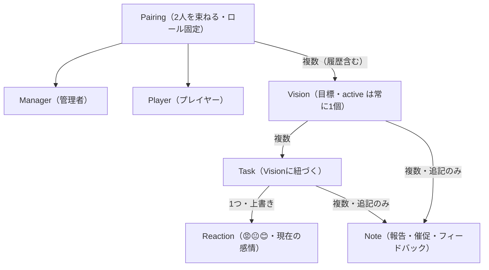
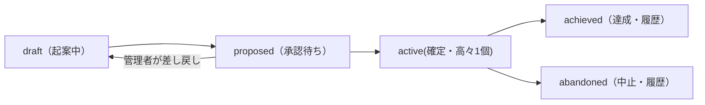
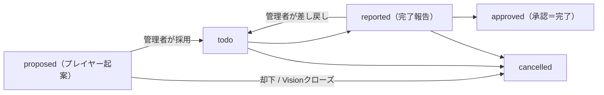

# PairCommit 設計メモ

> 表示名（`CFBundleDisplayName`）は **「ふたりの帆柱」**。ユリシーズが自分を帆柱に縛らせ、部下に「頼んでも解くな」と命じた構造がこのアプリそのもので、縛られる側だけでは装置にならない。ふたり、を頭に置くのはそのため。
> `PairCommit` は開発用の仮名として、リポジトリ・Bundle ID・モジュール名に残す。表示名とは切り離して扱う。
> 英語の表示名は **「Two at the Mast」**。「ふたり」を頭に置いた理由（縛られる側だけでは装置にならない）が、この名前ならそのまま成り立つ。候補にしていた `Mastbound` は縛られた側だけを指すので採らない。端末の言語が日本語なら日本語、それ以外は英語で出す。
> - リポジトリ / モジュール: `PairCommit`
> - Bundle ID: `com.fujimori.PairCommit` / CloudKit コンテナ: `iCloud.com.fujimori.PairCommit`

2人で使うコミットメントデバイス。自己管理が難しいのは「誰も見ていない」から、という前提に立ち、パートナーを観測者として置く。アカウンタビリティパートナーの仕組みをアプリ化する。

---

## コンセプト

- 本質は **他人を巻き込んだコミットメントデバイス**。ユリシーズが自分を帆柱に縛らせた構造。
- 普通のTodoアプリ（全ユーザー対等・フラット）と決定的に違うのは **ロールの非対称性**。設計の中心は機能ではなくロール。
- 「目的地は自分で選び、執行権限を相手に明け渡す」。支配ではなくコミットメントデバイスに留めるための境界が全体を貫く。

---

## ロール（決定）

- **Manager（管理者）** / **Player（プレイヤー）** の2値。
- スワップなし。入れ替えたい場合はアプリのリセットで再ペアリング。
- 非対称の中身:
  - 管理者: タスクの生成・完了承認・催促・ビジョン承認・ビジョン達成判断。
  - プレイヤー: ビジョンの起案、タスクの起案、完了報告と状況報告、感情の表明、管理者への催促。
- 管理者が絶対なのは **手段（タスク・承認）に対してであり、目的（ビジョン）に対してではない**。この境界が支配との分かれ目。

---

## ペアリング（決定）

- 方法は2つ。役割を選んだあとに「近くにいる相手と」か「離れている相手と」を選ぶ。近くなら2人がそれぞれ自分の役割を選び、離れていれば受ける側は届いた招待リンクを開く。
  - 受ける側のための入口（役割を選ばずに相手の残りの役割になるボタン）は置かない。近くの2人はその場で役割を決められ、離れた相手はリンクから入るので使う場面がない。置くと、リンクを受け取った人が押して、近くの端末を探し続けることになる。
- **近くにいる相手と: MultipeerConnectivity** を使う。Bluetooth/WiFiで近くの端末を発見して握手。
  - **MCはペアリングの瞬間にしか使わない。** 一回限りのイベント。リセットまで再利用しない。
  - 制約: MCは同じ場所にいる前提。離れた2台の日常的な同期には使えない。同期は別層（CloudKit）が担う。
  - MCの役割は「2人が同じペアであることを示す情報の交換」だけ。日常の通信路はサーバー（CloudKit）。
  - 共有は URL を知っている人が参加して書ける設定にする。URL を渡すのは MC で近くにいることを確かめた相手だけなので、名指しの招待は要らない。
- **離れている相手と: CloudKit が発行する共有の URL を招待リンクとして送る。** カスタム URL スキームと Universal Links は使わない。カスタム URL スキームはアプリが入っていない端末でタップしても何も起きず、ほかのアプリにも同じスキームを登録できてしまう。Universal Links は設定ファイルを置くサーバーが要る。
  - 招待リンクは URL を知っている人が参加できる共有にし、共有シートから LINE を含むどのアプリでも送れるようにする。相手の電話番号やメールアドレスは入力させない。
  - 相手が参加したら、その相手だけが参加できる共有（`publicPermission = .none`）をペアのルートレコードに作り、相手を参加者に足す。招待リンクの共有を、URL を知っていても参加できない設定に戻す形は取らない。CloudKit は、公開から `.none` に変えると参加済みの人をすべて外す。
  - 新しい共有の URL は招待リンクの共有のルートレコードに書いて相手に渡す。相手のアプリは画面を出さずにそれで参加し、参加したら招待リンクの共有を消す。リンクで参加できるのは最初の1人だけで、転送されたリンクでは参加できない。
  - 相手が参加したかは、サーバーにある共有の参加者の承諾状態で判定する。近くで繋ぐときの ACK の代わり。
  - 招待リンクには、受ける側の役割を書いた文を添える。受ける側は役割を選ばないので、参加する前に自分の役割を知る手段がほかにない。共有シートに出すアプリの名前は文に書かない。どのアプリで送るかは共有シートが出す。
  - 参加の手順は、両方のアプリが問い合わせを繰り返して進める。どちらかのアプリが閉じている間は止まるので、両方の画面にそう書く。受ける側の待ちの画面にも、やめるボタンを置く。置かないと、招待した側がアプリを開くまで抜けられず、参加したことは端末に残るので起動し直しても同じ画面に戻る。
  - リンクを開いたときに OS が渡してくる参加の情報からは URL だけを取り出し、参加するときにその URL から共有の情報を取り直す。通信は1回増えるが、外界の型を `Infrastructure` の外へ出さずに済む。
  - 招待中であることは端末に残し、開き直したら待ちの状態に戻す。招待をやめたら、作った共有を消して役割の選択に戻る。やめる後始末が失敗したときも、その途中であることを端末に残し、開き直したら相手待ちには戻さず後始末を続ける。止める前にペアができていた場合、相手待ちに戻すとそのペアに入ってしまうため。
  - すでにペアがある端末でリンクが開かれたら、参加せず、いまのペアも残す。
- 演出: NameDropの「ブワっ」はシステム専用でアプリから発火不可（NFCのP2Pモードがそもそもアプリに開放されていない）。ペアリング成功時のアニメは **自前で作る**。

## 同期層（決定: CloudKit）

- **CloudKit の Shared DB / CKShare** を使う。2人で特定レコードを共有する用途に設計されている。
- **CKSyncEngine は使わない**（当初は採用する決定だったが取り消した）。値を返す `CKDatabase` の async メソッドだけで書く。
  - 集約を1レコードに丸ごと入れ、書き込み（「報告・催促・フィードバック」参照）は対象のビジョンで絞って問い合わせるので、CKSyncEngine が肩代わりする変更トークン管理も保留キューも使い道がない。
  - 一方で CKSyncEngine は結果をデリゲートのコールバックで配るため、受け取る側に可変状態を強いる。同期層の実装を `let` だけの struct に保てなくなる。
- 保存は、もとにした状態からサーバーの状態が変わっていないときだけ通す。変わっていたら、取り直した最新の状態へ同じ操作を当て直して保存し直す。
  - 集約を丸ごと1レコードに書くので、後から書いた側を勝たせると、相手が別の項目に加えた変更まで巻き戻す（感情を付けた直後に承認されると、感情が消える）。
  - 当て直すのは操作で、状態どうしのマージはしない。相手が先に済ませていて操作が成り立たなくなったら、ドメインの拒否としてそのまま返す。
- 催促は端末が判定してローカル通知で出す。CloudKit subscription が飛ばすのは、そのきっかけになるサイレントプッシュだけ。
- **相手が自分に向けて行った操作も、プッシュで起こされた端末が通知する。** 見届ける人にはビジョンの提出・タスクの起案・完了報告・感情、挑む人にはビジョンの承認・差し戻し・達成判断と、タスクの追加・採用・承認・差し戻し・取り消し。何を知らせるかは、端末が最後に受け取った状態と取り直した状態を比べて決める（`PartnershipState.partnerActions(since:for:)`）。相手の役割にしかできない状態の変化だけを拾うので、自分の操作は知らせない。
  - 最後に受け取った状態は端末に残す。メモリにだけ持つと、iOS がアプリを終了させたあとにプッシュで起こされたとき、比べる相手がない。同じ理由で、起こされたときに画面がまだ状態を持っていなければ、端末に残したペアから状態を取り直す。ペアが終わったら消す。
  - アプリを開いている間に受け取った状態は、通知せずに残すだけにする。画面で見える。画面の側が状態を残すのは前面にいる間だけにする。バックグラウンドで取り直した状態を画面の側が先に残すと、プッシュを受けた側が比べる相手を失う。
  - プッシュを受けた側は、最後に受け取った状態を取り直したあとに読み、読んでから残すまでの間に中断を挟まない。取り直す前に読むと、続けて届いたプッシュがどちらも同じ状態と比べ、同じ操作を2度知らせる。
  - ビジョンを閉じたことで取り消されたタスクは、1件ずつ知らせない。閉じる判断はビジョンに対するもので、知らせるのは閉じたことだけ。
  - 感情は付け替えるたびに知らせ、通知センターにはタスクごとに1件だけ残す（同じ識別子で置き換える）。iOS は置き換えるたびに鳴らすので、鳴る回数は減らない。外したときは知らせない。
  - 通知を種類ごとに切る設定は持たない。どれも相手が返事を求めている操作か、自分が出したものへの返事で、要る・要らないが人で分かれない。アプリの通知をまるごと切るのは iOS の設定でできる。
- **相手の変更は、プッシュで起こされた側が取り直す。** 同期層から変更を配るストリームは持たない。配る形にすると、プッシュを受けたアプリ側は取り直しが終わったかを知れず、バックグラウンドの実行時間を返す判断ができない。
  - プッシュだけには頼らない。サイレントプッシュは間引かれることがあり、アプリを終了させている間は届かない。前面に戻ったときと、画面を引っ張ったときにも取り直す。
  - 取り直しの失敗を知らせるのは、画面を引っ張ったときだけ。頼まれていない取り直しの失敗でアラートを出すと、圏外のまま前面に戻るたびに操作を止めることになる。
- 採用理由: 本丸である「同期・認証・プッシュ」を3つともタダで肩代わり。2人なら無料枠に完全に収まる。
- **ロックイン: 両者ともApple端末必須。** ただし下記の隔離設計で、後からの置き換えを可能にしておく。
- 既知の制約:
  - 観測性が低い（サーバーが手元にない＝同期失敗のデバッグがブラックボックス気味）。
  - 共有レコードのzoneIDがオーナーと参加者で一致しない。参加者側がレコードを追加する設計では一手間。
  - Apple純正の上に乗るのでRustの素振りにはならない。

### 隔離設計（決定: 置き換え可能にする）

- Androidは今は対応しないが、**なくてもいい代わりに、後で置き換えられる構造にしておく。**
- アプリは外界（サーバー・ほかの端末・端末への保存・通知・端末上のモデルなど、アプリが仕事を頼む相手）と、Domain が持つ約束（protocol）越しにだけやり取りする。外界の技術は、その約束の実装の一つにすぎない。**Domain・Application・画面は、外界の技術の存在を知らない。**
- 利用者が目にする文と、利用者の言語で書く文（共有の名前・通知・モデルへの指示など）は、アプリが持って外界の実装に渡す。外界の実装は文を持たない。文はアプリが利用者に何を見せるかの決定で、外界の技術ではないので、外界の実装を差し替えても文は変わらない。
- 約束は、Domain が何を保証されれば動くか（セマンティクス）から先に決める。外界の技術の形に合わせて約束を決めない。
- これにより第二期のRust/自作バックエンドは「もう一つの実装」を差すだけで済む。
- 層ごとの役割、依存の向き、モジュールの分け方は CLAUDE.md の「層と依存」に従う。

### 第二期構想（後回し）

2人版が関係性ツールとして機能すると検証できたら、自作Rustバックエンドに載せ替えてRust化＆Android対応。**コンセプト検証とインフラ学習は同時にやらない。**

---

## ビジョン（決定）

- **アクティブなビジョンは高々1個** という不変条件が中心。タスクの無限増殖を防ぎ、焦点を1つに絞ること自体が規律になる。
  - 厳密には「同時に2個以上は存在しない」。0個は初期状態とクローズ直後にだけ現れる過渡状態で、UIは次のビジョン設定へ誘導する。
- 発生源はプレイヤー、執行権限は管理者。
- ライフサイクル: `draft`（起案中）→ `proposed`（承認待ち）→ `active`（確定・高々1個）→ `achieved` / `abandoned`（履歴）
  - 管理者は `proposed` を承認せず **draft に差し戻せる**（却下は削除ではなく差し戻し。起案の主導権はプレイヤーに残る）。
  - `draft` の間は、プレイヤーが中身を書き直せるし、取り下げられる。取り下げた起案は記録に残さない。合意に至っていないので、2人で歩んできた記録には当たらない。
  - `proposed` になったら書き直しも取り下げもできない。提出したあとは管理者の番で、承認するかを決めている間に、見ている中身が変わったり消えたりしないようにする。引っ込めたいときは差し戻しを待つ。
  - 書いたビジョンは、下書きを経ずにそのまま提出する（`submittingVision`。書き直したときは `resubmittingVision`）。分けると、タスクの「起案する」は押せば相手に届くのに、ビジョンの「起案する」は届かない、という食い違いが出る。このため `draft` は差し戻されたときにだけ現れ、プレイヤーの画面には差し戻されたことを出す。
- タスクの `todo → reported → approved` と対称。どちらも「起案→承認」の型。
- **達成判断は管理者の質的判断**。タスクの自動ロールアップではない（タスク=具体、ビジョン=抽象なので機械的には決まらない）。
- ビジョンのカードには、配下のタスクの進み具合（採用前の起案と取り消したものを除いたタスクのうち、承認されたものの数と割合）を出す。どこまで進んだかを2人が同じ数字で見るためのもので、達成判断には使わない。採用前の起案は管理者がまだ受け入れていないので数えない。数えると、プレイヤーが起案しただけで割合が下がり、却下されると戻る。
- 達成の基準だけはペアリング/設定時に2人で言語化しておく（管理者の判断が気分で揺れないように）。**執行は独裁、憲法は共同制定。**
- ビジョンを閉じるとき、配下の未承認タスクも一緒に閉じる（残骸を引きずらない）。
- 閉じたビジョンの履歴 + 感情リアクションの履歴 = **2人で歩んできた記録**として積み上がる。
- 記録は起案の新しい順に並べる。閉じた順にするには閉じた時刻をモデルに足すことになり、同期して両者で一致させる項目が1つ増える。

### ビジョンのフォーマット

| 項目 | 必須/任意 | 役割 |
|---|---|---|
| statement（一文） | 必須 | ビジョンそのもの。例「半年で10kg痩せて健康診断オールA」 |
| doneCriteria（達成基準） | 必須 | 管理者の達成判断のよりどころ。憲法の改正条件にあたる |
| deadline（期限） | 推奨 | 催促のペース配分に直結。残り日数で催促の強弱を決める |
| why（動機） | 推奨 | 管理者が催促トーンを測る材料 + プレイヤーがしんどい時に立ち返る錨 |

---

## タスク（決定）

- 管理者が所有・生成する。
- ライフサイクル: `proposed`（プレイヤー起案・採用待ち）→ `todo` → `reported`（プレイヤーが完了報告）→ `approved`（管理者が承認＝完了）。ほかに `cancelled`（却下 / Visionクローズ時の巻き込み）。
  - 管理者が生成したタスクは `todo` から始まる。プレイヤー起案は `proposed` から始まり、管理者の採用（→ `todo`）/ 却下（→ `cancelled`）を待つ。
  - 管理者は `reported` を承認せず **todo に差し戻せる**（やり直しの指示）。
  - `approved` は取り消せない終端。未完了（`proposed` / `todo` / `reported`）は管理者がいつでも `cancelled` にできる。
  - 管理者は `cancelled` を、取り消す前の状態に戻せる。誤って取り消したときのため。戻せるのはビジョンが active の間だけで、閉じたビジョンのタスクは記録として固定する。戻す先を `todo` に揃えないのは、`reported` を戻すとプレイヤーが完了を報告し直すことになり、`proposed` を戻すと採用したことになるため。取り消す前の状態はタスクに持たせる。古い版のアプリが状態を書き戻すと消え、そのタスクは戻せなくなる。
- プレイヤーが done にしても **承認待ちで止まる**。完了承認は管理者が握る。
- 必ずビジョンに紐づく（全タスクが唯一のビジョンに奉仕する）。タスクは **active なビジョンの下にしか作れない**。
- 承認待ちが溜まったとき管理者にも催促飛ばす
- 起案はプレイヤーもできる（所有・承認は管理者のまま）。プレイヤーにできるのは起案まで。

## 感情リアクション（決定）

- **チャットにしない。** チャットは返信義務を生んで関係を重くする。
- 感情は `Message` ではなく `Reaction`。**対象（Task）に従属する属性**。ストリームではなくステート（その対象に今どう感じているか）。
- 対象は **Task のみ**（Vision への感情表明は持たない）。
- ポジティブもネガティブも両方表現できる。ネガを安全に出せないと「健全に見せる」圧力でしんどさが隠れ、管理者が催促を手加減できなくなる。
- タスク一覧が **感情のヒートマップ** に見える。文字を読まずに関係の温度がわかる。

> 決定：😡 😐 😊

## 報告・催促・フィードバック（決定）

- 2人が対象に書き残す短い文（`Note`。以下、書き込み）。種類は3つ。
  - 状況報告（`report`）── プレイヤーだけが書く。どこまで進んだか、どこで止まっているか。タスクの完了報告（`reported`）とは別で、状態を変えない。
  - 催促（`reminder`）── どちらからでも書く。プレイヤーから管理者へ承認を促すこともある。期限と滞留から端末が判定して出す催促（`Nudge`）とは別で、人が送るもの。
  - フィードバック（`feedback`）── どちらからでも書く。相手の報告・催促・完了報告への返し。
- 対象は、閉じていないビジョン（`draft` / `proposed` / `active`）と、active なビジョンのタスク。タスクは状態を問わない（承認したタスクへのフィードバックも、取り消したタスクへの返しも書ける）。全体の進み具合の報告や「止まっていないか」の催促は、特定のタスクに結び付かない。
- **プレイヤーが出したもの（起案・完了報告）を管理者が受け入れないときは、理由を必須にする。** ビジョンの `proposed → draft`、タスクの `reported → todo`、`proposed → cancelled`（起案の却下）、`reported → cancelled` が対象。理由は管理者のフィードバックとして対象に残し、状態の変更と同じ保存で書く。理由が無いと、プレイヤーには何を直せばよいか、なぜ退けられたかが分からない。`todo` の取り消しは、管理者が自分の手段を引っ込めるだけなので理由を求めない。理由を求めるのは、管理者がそのタスクやビジョンを選んで退ける操作（差し戻し・取り消し）で、ビジョンを閉じたことによる配下のタスクの巻き込みは含まない。閉じる判断はビジョンに対するもので、巻き込まれるタスクごとの判断ではない。
- 書き込みには、ペアの中で通しの番号を振る。集約が次の番号を持ち、書くたびに1つ進める。書いた時刻は表示のためだけに持ち、書いた側の端末の時計で決める。
- 書いたら相手に通知する。相手の変更を知らせるサイレントプッシュは「何か変わった」としか伝えないので、通知は受け取った端末が出す。端末は「どこまで知らせたか」の番号を1つだけ持ち、プッシュで起きたら、相手が書いたそれより大きい番号の書き込みを通知して番号を進める。アプリを開いたときは画面で見えるので、通知せずに番号だけ進める。番号を持たないと、取り直した状態のどれがまだ知らせていない書き込みか分からず、同じものを何度も知らせる。催促（`Nudge`）は状態から導けて解消すれば消えるので識別子を固定するだけで済んだが、書き込みは消えずに溜まる。
  - 時刻で比べない。書いた時刻は書いた側の時計なので、2台の時計がずれていると取りこぼすか同じものを知らせ直す。保存が届く順と書いた順が入れ替わっても取りこぼす。番号は集約の保存と一緒に確定するので（下の置き場所を参照）、大きい番号が見えた時点で、それより小さい番号はすべて保存済み。
  - この番号は通知のためだけに持ち、画面には出さない（下の「未読・既読は出さない」と矛盾しない）。
  - プッシュは間引かれることがあり、アプリを終了させている間は届かない。届かなかった間の書き込みは通知されず、次に開いたときに画面で読む。
- **書き込みは集約とは別に、1件ずつ別のレコードに置く。** 集約は1レコードに丸ごと入れていて、レコードには大きさの上限（1MB）がある。書き込みは消さずに溜まるので、集約に入れるといつか上限に届き、承認や完了報告も含めて保存がすべて失敗する。
  - **書き込みは、集約のレコードと同じゾーンに、集約と一緒にまとめて保存する（片方が失敗したら両方通さない）。** 書き込みのたびに集約の番号が進むので、集約の保存は「もとにした状態から変わっていないときだけ通す」の対象になる。確かめてから書くまでの間に相手が状態を変えていれば保存ごと通らず、取り直した状態へ操作を当て直す（同期層の決定と同じ）。書けるか（対象が閉じていないか、そのロールに許されているか）は、当て直すたびに集約で確かめ直す。
  - これで、差し戻しと理由、起案の取り下げとその書き込みの削除も、同じ1回の保存になる。差し戻していないのに理由だけが残ることも、消した起案に書き込みが残ることもない。
  - 取り直すときは、集約と、閉じていないビジョン（とその配下のタスク）の書き込みだけを、ビジョンで絞って問い合わせる。閉じたビジョンの書き込みは、記録を開いたときに取る。使い続けても、ふだんの取り直しは進行中のビジョンの分しか重くならない。
  - 通知のためには、これとは別に「どこまで知らせたか」の番号より大きい書き込みを番号で問い合わせる。ビジョンで絞るだけだと、書いた直後にビジョンが閉じられたとき（最後にフィードバックを書いてから達成にする）、その書き込みが問い合わせから外れて通知されない。
- **チャットにはしない。** 返信の義務が関係を重くする、という判断（感情リアクション）は保つ。書き込みは対象ごとの時系列の記録で、特定の書き込みに返信する繋がりは持たない。未読・既読や返事待ちも出さない。
- 書いたあとは書き直しも削除もできない。読んだあとで中身が変わると、それに返したフィードバックが何に対するものか分からなくなる。
- 閉じたビジョンの書き込みは、配下のタスクのものも含めて記録に残す。取り下げた起案（`draft` の破棄）の書き込みは、起案と一緒に消す。

---

## 見た目（決定）

- **ホームの先頭に、相手の名前と2人の関係を1行で出す**（「太郎さんが見届けています」「花子さんの挑戦を見届けています」）。役割名だけを出しても相手が誰かは分からず、ロールは固定なので変わらない値を出し続けるだけになる。名前も関係も出ていないと、開いたときに誰と何をしているアプリなのかが画面から分からない。相手がまだ名前を決めていなければ「相手」と出す。役割を選ぶ画面には役割名が残る。
- **ペアを組んだあとは、下のタブで「ホーム / 記録 / 設定」を切り替える。** 記録と設定への入り口を画面の上の角に置くと、片手では指が届かない。タップのほかに、左右のスワイプでも隣のタブへ切り替える。標準のタブバーを残すため、画面は指に追従させず、指を離したときに切り替える。指に追従させるにはページ形式に変えることになり、標準のタブバーが使えない。スワイプを受けるのは各タブの最初の画面だけにする。進んだ先の画面では、右へのスワイプは前の画面に戻る操作に使われている。文字を入力している間も受けない。カーソルの移動や範囲の選択で、指を横に動かすため。
- **ホームにはナビゲーションタイトルを置かない。** 先頭の1行が見出しの代わりになる。
- **見届ける人の達成判断は、ホームの末尾に置く。** タスクの承認や追加よりずっと稀な操作なので、毎日の操作より手前に置かない。
- **スクロールバーは出さない。** どの画面もカードを縦に並べただけで、位置を測る必要がない。
- **相手を指す語は残す。** 「管理者の承認を待っています」「プレイヤーの起案を待っています」のように、誰の番かを伝えている文には上の理由が当たらない。固定値の反復ではなく、消すと文が成り立たなくなる。
- **役割ごとに別のアクセント色を置く。** 管理者は藍、プレイヤーは濃い青緑。ロールは端末ごとに固定なので、片方の画面に出るのは常に同じ1色で、これだけでは見た人に自分の役割を教えない。2色が同じ場に並ぶのは、2人が端末を並べたときと役割を選ぶ画面だけで、色の役目はそこで別の側だと分かることにある。暖色を使わないのは、感情リアクションが赤・橙・緑を占めているため。役割色をそこへ寄せると、行の色が感情を指しているのか役割を指しているのか読めなくなる。寒色のうち systemTeal と systemCyan を使わないのは、白地に対して 2.6:1 しかないため。この色は tint を通してボタンの文字色になるので、本文として読める比が要る。濃い青緑は 5.6:1 で、藍の 5.7:1 と揃う。標準の systemBlue が出るボタンと同じ画面に並ぶので、青から離すことも要る。この色は明暗で2値を持たせる。藍はシステムカラーで暗い側では明るい方へ振れるため、1値のままにすると暗い背景でだけ藍と比が揃わなくなる。
- **iOS 26 では、ビジョンのカードを役割の色の濃淡を透かしたガラスにする。** 明るい側は役割の色の色相を少し進めた色。見届ける人の側だけ明るい側を暗くしてある。藍は色相を進めると明るい紫に寄り、そのままではカードの小さい白文字が 4.5:1 を割る。
- **感情の色は変えない。** 変えると、積み上がった履歴の読み方まで変わる。
- **感情は面、それ以外の意味は線で出す。** 赤・橙・緑は感情のほかにも、エラー・催促・達成基準の下読みで使っている。感情だけは行の背景（面）で出し、他は文字とアイコン（前景）で出す。色相が重なっても層が違えば意味は混ざらないので、暖色を意味ごとに割り当て直さずに済む。
- **ヒートマップは両側に出す。** 出した感情が自分の画面に残らないと、表明した手応えがない。
- **画面の先頭はビジョン。** active なビジョンは高々1個という不変条件が設計の中心なので、タスクの追加欄と同じ重さの節に置かない。画面の先頭のカードにして残り日数を出し、タスクはその下に従属させる。スクロールしても画面に留めることはしない。カードは達成基準と残り日数のバーまで持って縦に大きいので、留めるとタスク一覧に使える高さがその分ずっと削られる。
- **ビジョンを載せるカードは、期限が無くても同じ場所に「期限なし」と出す。** 期限は任意だが、カードは節と違って出さないという選択がなく、空欄にすると設定し忘れなのか意図的なのかが画面から分からない。承認するか差し戻すかを決める場面では、期限を決めずに起案したのか決め忘れたのかが判断の材料になる。カードの高さは期限の有無で変えない。
- **感情ボタンはタスク行の主役にしない。** プレイヤーが相手に伝える手段は、完了報告・状況報告・催促・感情と並んでいて、感情だけを一番押しやすくすると、言葉で伝える手段が脇に追いやられる。完了報告は塗りのボタンにし、感情ボタンはそれより低くする。
- **タスク一覧の操作の失敗はアラートで出す。** 行の下や一覧の末尾に出すと、一覧が長いときに見えないところに出て、振動しか伝わらない。入力欄の失敗は入力欄の下に出す。
- **タスクの追加と起案はシートで開く。** 一覧の末尾に入力欄を置くと、タスクが増えるほど遠くなる。一覧には開くボタンだけを置く。
- **済んだタスク（承認・取り消し）は一覧の下の節に分ける。** 作った順に混ぜると、残っているタスクを探すのに済んだものを読み飛ばすことになる。
- **取り消したタスクはホームに並べず、別の画面に分ける。** 済んだタスクの節には件数と入口だけを置く。承認したタスクは進み具合として残す意味があるが、取り消したものは2人がもう追わないもので、並べ続けるとノイズになる。戻す操作はその画面に置く。
- **取り消しは確認してから行う。** 取り消すと相手の画面からもすぐ消え、戻すには別の画面を開くことになる。承認待ちの行では差し戻しの隣に並ぶ。
- **触覚フィードバックは自分の操作にだけ返す。** 相手の変更が同期で届いたときには鳴らさない。鳴らすと、何も触っていないのに端末が震える。ペアリング中の状態の変化だけは鳴らす。2人が端末を並べて待っている場面で、相手が見つかった・つながった・失敗したを、画面を見なくても受け取れる。
- **ペアリングで待っている間は、画面の上のアイコンを動かす。** 文だけが変わる画面では、止まっているのか進んでいるのかが分からず、壊れたと思われる。失敗したら止める。
- **フォントは標準のまま。** 独自フォントを入れるとバンドルサイズが増える。
- **呼び名は「見届ける人」/「挑む人」、英語では「Witness」/「Challenger」。** 管理者・プレイヤーは、手段だけを握って目的は握らない、という境界を言い表せていない。**画面に残す語すべてに及ぶ** ── 役割を選ぶ画面と、相手を指す文の両方。片方だけ変えると、同じ相手を2つの名前で呼ぶことになる。及ぶのは画面に出す文字列だけで、型名（`Role.manager` / `.player`）もこの文書も管理者・プレイヤーで通す。この文書は型名を常に参照しているので、表示用の呼び名に置き換えると型との対応が読めなくなる。

---

## データモデル骨格

- **Pairing** ── 2人を束ねる。ロール固定。`ownerRole`（共有オーナー側が取ったロール）を持ち、各端末の自ロールはこれと「自分がオーナーか」から定まる。
  - 2人それぞれの名前を持つ。相手の画面に出すためのもので、決められるのは本人だけ。ペアリングでは交換せず、ペアを組んだあとにホームの前で入力してもらい、設定でいつでも変えられる。ペアリングの手順に足すと、近くでつなぐ方法と招待リンクの両方で受け渡しを足すことになる。名前を持つ前に作ったペアも読めるよう、未定（nil）を許す。
  - 名前は、状態を丸ごと入れた JSON とは別の項目に置く。名前を知らない版のアプリは、読み込んだ状態を JSON ごと書き戻す。JSON に入れると、2人の版がずれている間、古い版の側が何か操作するたびに名前が消え、新しい版の側には名前の入力画面が出直す。古い版はレコードの JSON の項目だけを書き換えるので、別の項目に置いた名前は残る。
- **Vision** ── プレイヤーの目標。タスクの上位。active は高々1個。status を持つ。
- **Task** ── 管理者所有。Visionに紐づく。status を持つ。**コード上の型名は Swift Concurrency の `Task` と衝突するため `TaskItem`**（設計上の呼称は「タスク」のまま）。
- **Reaction** ── 対象（Task）に貼る感情。ポジ/ネガ。実装上は Task の属性（上書き更新のステート）。
- **Note** ── 対象（Vision か Task）への書き込み（報告・催促・フィードバック）。書いた側のロールと種類、ペアの中での通しの番号、書いた時刻を持つ。追記だけのストリームで、集約と同じゾーンの別のレコードに1件ずつ置き、集約と一緒に保存する。

### リレーション図

```mermaid
graph TD
    Pairing["Pairing（2人を束ねる・ロール固定）"]
    Manager["Manager（管理者）"]
    Player["Player（プレイヤー）"]
    Vision["Vision（目標・active は常に1個）"]
    Task["Task（Visionに紐づく）"]
    Reaction["Reaction（😡😐😊・現在の感情）"]
    Note["Note（報告・催促・フィードバック）"]

    Pairing --> Manager
    Pairing --> Player
    Pairing -->|"複数（履歴含む）"| Vision
    Vision -->|"複数"| Task
    Task -->|"1つ・上書き"| Reaction
    Vision -->|"複数・追記のみ"| Note
    Task -->|"複数・追記のみ"| Note
```

**カーディナリティと不変条件**
- `Pairing` は必ず `manager` 1 + `player` 1 の **2人ちょうど**。ロール固定・スワップなし。
- `Vision` は `Pairing` に N 個ぶら下がる（履歴含む）が、**`status == active` は高々1個**（中心の不変条件。0個は初期状態・クローズ直後のみ）。
- `Task` は必ず1つの `Vision` に紐づく（孤立タスクは存在しない）。所有は manager、`createdBy` で player 起案かを区別。
- ビジョンの一文・達成基準と、タスクの名前は、空白だけにはできない。空白だけの動機とタスクの詳細は、書かなかったもの（nil）として持つ。どれも前後の空白と改行は落として持つ。残すと、空白だけかの判定に使った文字列と持つ値が食い違い、一文の上に空行が出たりする。
- ビジョンとタスクの期限は日時で持ち、決めるときと、効き始めるとき（ビジョンの提出・承認、タスクの採用）に、今より後でなければならない。過ぎた期限のまま効き始めると、その瞬間から期限切れの催促が出る。承認や採用を待つ間に期限が過ぎたら、管理者は差し戻すか取り消し、プレイヤーが期限を決め直す。
- `Reaction` は `Task` に従属する **ステート**（ストリームではない）。1タスクにつき player の現在の感情1つ（上書き更新）。Vision には感情を持たない。
- `Note` は必ず1つの `Vision` か `Task` に紐づく。書けるのは、閉じていないビジョンと、active なビジョンのタスクにだけ。`report` は player だけが書ける。本文は空白だけにはできず、前後の空白と改行は落として持つ。
- 不変条件・ロール権限・状態遷移の番人は集約ルート `PartnershipState`（ドメイン層）。UI や同期層は個別レコードを直接いじらない。

### 状態の流れ（ステータスがどう移り変わるか）

Vision（閉じる時、配下の未承認タスクも一緒に閉じる）

```mermaid
graph LR
    draft["draft（起案中）"] --> proposed["proposed（承認待ち）"] --> active["active(確定・高々1個)"]
    proposed -->|"管理者が差し戻し"| draft
    active --> achieved["achieved（達成・履歴）"]
    active --> abandoned["abandoned（中止・履歴）"]
```

Task（未完了状態からは管理者がいつでも `cancelled` にできる。ビジョンが active の間は、取り消す前の状態に戻せる）

```mermaid
graph LR
    proposed["proposed（プレイヤー起案）"] -->|"管理者が採用"| todo["todo"]
    todo --> reported["reported（完了報告）"] --> approved["approved（承認＝完了）"]
    reported -->|"管理者が差し戻し"| todo
    proposed -->|"却下 / Visionクローズ"| cancelled["cancelled"]
    todo --> cancelled
    reported --> cancelled
```

管理者が生成したタスクは `todo` から始まる（`proposed` を経ない）。

## 未決事項まとめ

1. MCで何を渡すか（CKShare URL or 独自トークン）と、CloudKit Sharingの招待フローとの噛み合わせ
   -> **方針決定: MCで `CKShare.url` を手渡し、参加者は共有シートを経由せず `CKFetchShareMetadataOperation` + `CKAcceptSharesOperation` でプログラム受諾**（独自トークンは不要）。
   -> **成功判定はACKで締める**: 参加者が受諾を終えたらMCで ACK を返し、オーナーはそれを受けて初めて成功にする（URL送信だけで成功表示すると相手の受諾失敗を見逃す）。
   -> スパイク実装済み（`PairCommit/Partnership/`）。
   -> **実行検証はこれから**: MC は実機同士でないと繋がらないので、この検証だけは実機2台が要る。
   -> 離れた相手とは、MC の代わりに共有の URL を招待リンクとして送る（「ペアリング（決定）」参照）。成功判定は ACK ではなく、相手だけが参加できる共有の参加者の承諾状態で締める。これも実機2台での検証がまだ。
2. データモデルのリレーション図作る -> 済（「データモデル骨格 > リレーション図 / 状態の流れ」参照）
3. ビジョン達成時のお祝い演出 → 次ビジョン設定への画面遷移 -> 済。達成済みビジョンの有無から導いて出す（見たかどうかの状態は持たない）。
4. ビジョンのクライテリアをFoundationModelに基準をレビューさせてもよい -> 済。境界は `CriteriaReviewing`（Domain）、実装は端末上のモデルを使うのでアプリターゲット。使えない端末では機能ごと出さない。
5. **ペアリング時のロール割り当て** -> 済。最初の画面でロールを選ぶ。2台はつながったら、まず選んだロールを MC で送り合い、その組み合わせで共有を作る側を決める。共有を作る側は自分のロールを入れた状態をルートレコードに書いてから共有し、CKShare の URL を MC で渡す。受ける側は MC でロールを受け取るのではなく、参加後に読み込んだ状態から `ownerRole` を読む。
   - 最初の画面は「どちらで使いますか」と聞き、2人がそれぞれ自分のロールを選ぶ。ロールが違えば、そのままペアにする。共有は見届ける人を選んだ側が作り、挑む人を選んだ側が受ける。
   - ロールが同じときは、共有を作る前に止めて、片方に選び直してもらう。
   - 共有を作る側の iCloud が容量を理由に作成を断ったら、もう片方が代わりに共有を作り、断られた側が受ける。`ownerRole` は共有を作った側のロールなので、代わりに作る側は相手のロールの反対を書く。どちらの端末のロールも、選んだとおりになる。代わりに作る側も失敗したら、断られた側には容量の案内を出す。
6. **片側リセット時の整合性** -> 決定。**リセットは片側だけでは終われない。必ず両者のパートナーシップが終わる。**
   - ペアは2人でしか成り立たない。片方が抜けた状態はどの不変条件も満たさず、管理者だけでもプレイヤーだけでも何も進められない（起案しても承認する相手がいない）。半分だけ生き残らせると、動かないアプリが手元に残る。
   - 共有を作った側は private DB のゾーンごと消す。受けた側は共有されたルートレコードを消す。共有ゾーンを消しても抜けるのは自分だけで、共有を作った側のレコードは残るため。
   - 相手側は次の取得でレコードが無くなっているので、`pairing` が nil の状態になり最初の画面に戻る。**終了フラグは状態に足さない。** レコードの不在がそのまま「もう無い」を表しているので、増やすと同じことを2通りで表すことになる。
   - 入り口は設定タブの「ペアリングをやり直す」に置く。ふだんの操作と同じ画面に、すべてを消す操作を置かないため。破壊的なので確認を挟む。
7. **催促の具体仕様**（ロードマップ7）-> 決定。判定は `PartnershipState.nudges(for:now:)` の純粋関数。
   - タスクの期限切れ / 期限まで3日以内 -> プレイヤーへ
   - 完了報告から2日たっても承認されない -> 管理者へ
   - 進行中ビジョンの期限切れ -> 管理者へ（達成判断を促す）
   - 逆算の「ペース」は入れない。ビジョンには承認済みのタスクの割合があるが、タスクは大きさがそろっておらず、あとから足されて分母も増える。日数の割合と比べても、遅れているかは分からない。
   - アプリ内表示と端末の通知の両方。判定し直すのは、画面の状態が変わったときと、相手の変更で飛ぶサイレントプッシュで起きたとき。アプリ内の表示は、開いている間1分ごとにも判定し直す。期限も催促の始まりも日付の境目ではなく任意の時刻なので、表示が遅れるのは最大1分に収まる。通知は、いま始まっている催促を出すものと、まだ始まっていない催促を始まる時刻に予約するものの2つ。予約があるので、誰も操作しないまま期限が過ぎても鳴る。プッシュで起きたときの判定と通知の掲示は画面の外（アプリのデリゲート）で行い、それが終わってからバックグラウンドの実行時間を返す。通知は催促1件につき1つで、識別子を固定して差し替える（同じ催促が続く間に増えない）。解消した催促の通知は取り下げる。配信済みのものは出し直さない。

8. **テストとプレビューの代用品の置き場所** -> 決定。使う側に置く。テストの代用品はテストの中、プレビューの代用品はアプリの中。`Infrastructure` には実物だけを置く。

9. **ウィジェット** -> 未決。やるかどうかから決めていない。やる場合に出すのは、自分のタスク一覧ではなく相手が待っていること ── 管理者には承認待ちの件数、プレイヤーには進行中のビジョンと残り日数（期限が無ければ「期限なし」）と未完了の件数。アプリを開かなくても相手の存在が見えている状態を作るのが目的なので、一覧の縮小版にすると開かない理由になって逆効果になる。サイズは small 1つ。ウィジェットから共有 DB を直に読むと、ウィジェットの更新の中でネットワーク取得をやることになる。アプリが App Group にスナップショットを書き、ウィジェットはそれを読む。App Group は entitlement なので capability の追加が要る。

## 現状（2026-09-24 時点）

**できていること**:

- ドメイン層 ── 不変条件・ロールガード・全遷移。状態を変える操作は受け取った値を変更せず新しい値を返す（`mutating` なし）。
- 同期境界 `PartnershipSyncing` と、CloudKit 実装・インメモリ実装。UI結節点の `PartnershipStore`。インメモリ実装はテスト専用。
- 実装は `LocalPackage` の `Domain` / `Application` / `Infrastructure` に分離。テストは `LocalPackage/Tests/` へ層ごとに置き、`Scripts/unit-test.sh` だけで回る（シミュレータ不要）。アプリ側に残るのは VRT のみ。
- CI は2本立て。`unit-tests.yml`（ubuntu・`Scripts/unit-test.sh`）と `ci.yml`（macOS・アプリのビルドと VRT）。
- TestFlight への配信は `testflight.yml`（手動実行・main のみ・`Scripts/testflight.sh`）。署名は自動署名のまま、App Store Connect の API キーで Xcode に証明書とプロファイルを用意させる。証明書とプロファイルを Secrets に置かないので、期限が切れるたびに差し替える手間がない。
- VRT（Prefire）・SwiftLint の自動化基盤、設計・テスト原則の明文化（CLAUDE.md）。
- ロール別UI ── ビジョンの起案から承認・達成判断まで（`PairCommit/Vision/`）と、タスクの起案・採用・完了報告・承認・感情表明（`PairCommit/Task/`）。ビジョンとタスクに期限を設定できる。
- 閉じたビジョンの記録 ── 達成・取りやめたビジョンと、その配下のタスク・感情を見返せる（`PairCommit/History/`）。
- 催促の判定 ── 期限と滞留から誰を催促するかを決める純粋関数（`Nudge`）。判定に使う時刻は引数で渡す。まだ始まっていない催促は始まる時刻も返し、端末の通知として予約する。誰も操作しないまま期限が過ぎても、予約した時刻に鳴る。
- タスク一覧は両側とも、行の背景を感情の色で塗る（絵文字と併記。色だけに意味を持たせない）。
- 達成基準の下読み ── 境界は `CriteriaReviewing`。
- 失敗は型で流す。ドメインの操作の失敗も、外界との約束ごとの失敗も、Domain の型にする。Store はそれらを畳んだ型を投げる。
- 通信の失敗は、利用者が自分で手を打てる単位に分けて見せ、元のエラーは画面に出さずログ（`Logger`、サブシステム `com.fujimori.PairCommit`）に残す。error レベルは端末に保存されるので、あとから Mac につないで Console.app で読める。
- ペアリング結果（ルートレコードのIDと、共有を作った側かどうか）は端末に残し、起動し直したら前回の相手につなぎ直す。つながらないだけならペアは残して再試行を出し、ペアが終わっていたときだけ役割の選択に戻す。
  - 端末に残したペアリング結果は、アプリを消すと一緒に消える。iCloud の共有は残り、相手の端末はペアのまま使い続けるので、入れ直した側だけ役割の選択から始めると2台の認識がずれる。起動したときに端末に残っていなければ iCloud に残っているペアを探し、見つかればそこへつなぎ直す。確認は挟まない。やめたいときは設定の「ペアリングをやり直す」で相手の側も終わらせる。
  - つなぎ直しをあきらめて役割の選択に戻ったときは、そのことを端末に残し、次にペアを組むまで探さない。残さないと、起動し直したときに同じペアへ引き戻す。端末に残すので、アプリを入れ直せば一緒に消え、入れ直したときの復帰は妨げない。あきらめるときにペアを終わらせる形は取らない。つながらない理由は通信や iCloud の側にあることが多く、相手の側のペアまで終わらせることになる。
  - 探すのに失敗したときは、そのまま役割の選択を出す。
  - 相手が参加していない共有（作る側で途中で終わったペアリングの残り）は選ばない。候補が複数あるとき（前の相手がペアを終えていない共有が残っている）は、最後に書き換えられたものを選ぶ。
- 相手の変更を受け取る経路 ── サイレントプッシュで起きて状態を取り直し、催促と相手の操作を通知として出すところまでを画面の外で行う。

**まだないもの**:

- 予約した催促の取り下げ。予約した通知の文面は予約した時点の状態で作り、配信済みの通知を時刻で取り下げる手段もないので、相手の変更がこの端末に届かないまま時刻が来ると、次にアプリが開かれるかプッシュで起きるまで、もう解消した催促が鳴って通知センターに残る。プッシュの配送は保証されないので、この制約は残る。
  - 時刻が進むだけで解消する催促（期限が近い → 期限切れ）も通知センターに残る。期限が近い催促の文面は期限の日付を言うだけにしてあるので、期限を過ぎて残っていても嘘にはならない。同じタスクの2つの催促で通知の識別子を共有して置き換える形は取れない。どちらもまだ始まっていないうちは両方を予約する必要があり、同じ識別子の予約はあとから足したほうで置き換わる。
- ウィジェット用の App Group の capability。
- ログを端末から書き出す手段。Mac につなげない相手の端末のログは、sysdiagnose を取ってもらうしかない。
- CloudKit のスキーマの本番環境への反映。開発環境で作られたレコード型は、CloudKit Console で本番へ反映するまで、App Store や TestFlight から入れたアプリでは使えない。

**保留**: 実機での検証。MC はシミュレータ同士では繋がらないので、ペアリングから先は実機2台でしか動かせない。1台だけで使う入り口（`LocalPairing`）は、ペアリングを本物にしたときに落とした。

## 次のタスク（実装ロードマップ）

方針: **本体は CloudKit を待たずインメモリ実装で進める**。設計の隔離（`PartnershipSyncing`）がここで効く。

1. **ドメインモデル定義** -> 済（`LocalPackage/Sources/Domain/`）。
2. **`PartnershipSyncing` プロトコル定義** -> 済（同上。セマンティクスはdoc comment参照）。
3. **`InMemorySynchronizer` 実装** -> 済（`Tests/ApplicationTests/`）。UI結節点の `PartnershipStore` は `Sources/Application/`。
4. **ドメインロジック＋不変条件＋ユニットテスト** -> 済（集約ルート `PartnershipState`。テストは `LocalPackage/Tests/`）。
5. **ロール別UI** -> 済。View はアプリターゲットに置く（`Presentation` モジュールは作らない ── アプリターゲットがすでにパッケージの外側で、公開APIの境界はそれで効く）。
   - Manager: タスク生成・採用・承認・差し戻し・取り消し、ビジョン承認・達成判断、催促の表示、感情ヒートマップ（行の色）。
   - Player: ビジョン起案・タスク起案・完了報告・感情表明（😡😐😊）、催促の表示、感情ヒートマップ（行の色）。
   - ロールはペアリングのときに固定する（未決事項5）。近くなら2台がそれぞれ違うロールを選び、離れていれば招待した側が選んで、リンクで参加した側が残りのロールになる。
6. **ライフサイクルUI** -> 済。Vision（draft→proposed→active→achieved/abandoned）/ Task（proposed→todo→reported→approved / cancelled）の遷移はすべてUIから辿れる。
7. **催促ロジック（双方向）** -> 判定はドメインの純粋関数として済（`Nudge` / `nudges(for:now:)`）。アプリ内表示と端末の通知も済。アプリを開いていない間も、予約した通知で鳴る。
8. **`CloudKitSynchronizer` 差し替え＋#1実行検証** ← **いまここ**。実装と配線は済（`LocalPackage/Sources/Infrastructure/`）。残りは実機2台での実行検証。
9. **（できれば）** 達成お祝い演出→次ビジョン設定 -> 済。Foundation Models でクライテリアをレビュー -> 済。
